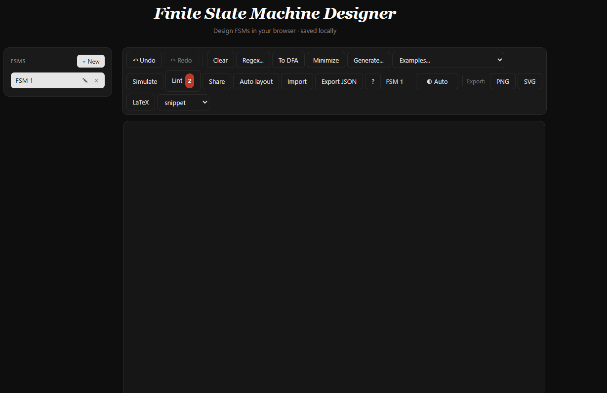

# FSM Studio

A browser-based finite state machine designer with a built-in simulator, a regex-to-NFA converter, subset construction, DFA minimization, and a natural-language helper. Vanilla JavaScript, no runtime dependencies, runs on phones.

**Live demo:** https://formalsketch.github.io


<!-- Add a 5-10s screen capture of the simulator stepping through "0110" as
     docs/simulator.gif, then un-comment the line below. -->
<!--  -->

## What's new in this fork

Forked from [evanw/fsm](https://github.com/evanw/fsm) (2010) and rewritten as a learning environment for automata theory courses. Compared to upstream:

- Snapshot-based undo / redo
- Multi-FSM workspace persisted to localStorage with a sidebar to switch between diagrams
- Light, dark, and system themes that follow `prefers-color-scheme`
- NFA simulator with step-by-step playback and current-state highlighting
- Regex-to-NFA via Thompson's construction
- NFA to DFA via subset construction; DFA minimization via partition refinement
- Sugiyama-style auto-layout for generated diagrams
- Diagram-level lint warnings (no start state, nondeterminism, missing transitions, unreachable states)
- Share a diagram by URL (base64-url of the JSON in the hash)
- Import / export as versioned JSON (`fsmStudio.v1`)
- Natural-language helper that turns a description into an FSM (and back)
- Mobile-friendly: touch input, responsive canvas, floating arrow-mode toggle
- Keyboard-only operation: Tab to cycle, N to add a state, L to add a link, arrows to nudge
- LaTeX export with standalone-document and snippet modes; expanded shortcut table covering Greek, operators, set theory, logic, arrows

## Features

- HTML5 canvas drawing of states (Node, accept state) and transitions (Link, SelfLink, StartLink)
- Drag to move, double-click to add a state, shift-drag to add an arrow, Delete to remove
- Multiple symbols per transition (comma-separated), epsilon transitions (empty label)
- Export as PNG, SVG, or LaTeX (TikZ-compatible)
- Greek letter shortcuts (`\beta` -> beta), subscripts (`S_0` -> S subscript 0), and more

## Quickstart

```bash
git clone https://github.com/formalsketch/formalsketch.github.io.git
cd formalsketch.github.io
node build.js
```

Open `index.html` in a browser, or serve the directory with any static server. `node build.js --watch` rebuilds on save. A Python 3 builder (`python build.py`) is also provided and produces a byte-identical bundle.

## How to

### Build a DFA by hand

1. Double-click empty canvas to add a state.
2. Double-click the state to toggle accept.
3. Shift-drag from one state to another to add a transition; type its label (try `\alpha` or `0,1`).
4. Click the floating arrow tail in front of the start state to label the start arrow (or leave it blank).
5. Click `Lint` and verify there are no errors.

### Simulate a string

1. Click `Simulate` to open the panel.
2. Type your input (e.g. `0110`) and hit Enter to run, or press `Step` to walk one symbol at a time.
3. The current state(s) get a colored ring; the traversed link briefly flashes. Status shows `Accepted` (green) or `Rejected` (red).

### Use the generation panel

1. Click `Generate...`.
2. Paste your API key into the field at the top and click Save. The key is stored only in `localStorage` on this browser.
3. Type a description (`accept binary strings with an even number of 1s`) and click `Generate as new FSM`. A new diagram appears in the sidebar.
4. To go the other direction, switch to any diagram and click `Describe current FSM` for a plain-English summary.

## Tech stack

- Vanilla JavaScript, no framework, no bundler. `build.js` concatenates `src/**/*.js` in deterministic order.
- HTML5 canvas for drawing; the same drawing code feeds the canvas, SVG exporter, and LaTeX exporter through a shared 2D-context-shaped interface (see `docs/architecture.md`).
- GitHub Pages for hosting; the deploy workflow rebuilds the bundle and uploads `index.html` + `fsm.js` on push to `main`.
- Prettier as the only devDependency.

## Attribution

Based on the Finite State Machine Designer by **Evan Wallace** (2010), released under the MIT License. This fork is developed by **Iman Mohammadi** (2026). The modular structure (history / theme / workspace / I/O / UI) is adapted from the open pull request [evanw/fsm#45](https://github.com/evanw/fsm/pull/45), with feature work pulled in from upstream PRs [#17](https://github.com/evanw/fsm/pull/17), [#23](https://github.com/evanw/fsm/pull/23), [#25](https://github.com/evanw/fsm/pull/25), [#34](https://github.com/evanw/fsm/pull/34), [#39](https://github.com/evanw/fsm/pull/39), and [#44](https://github.com/evanw/fsm/pull/44). See [LICENSE](LICENSE) for the combined notice.

## License

MIT - see [LICENSE](LICENSE).
