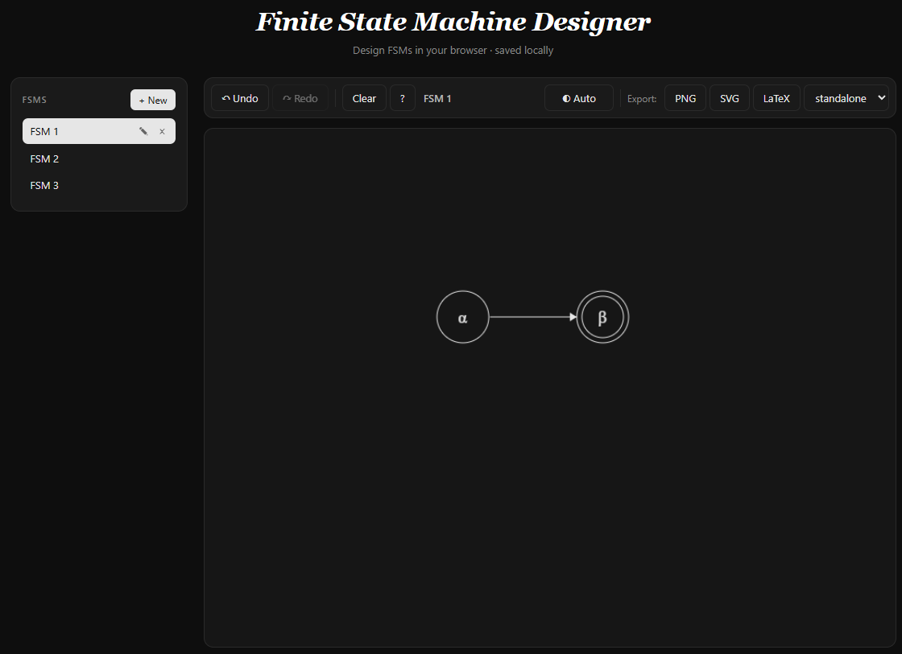

# Finite State Machine Designer

A browser-based, dependency-free FSM designer. Draw states and transitions on a canvas, save them locally, export to PNG, SVG, or LaTeX. Originally written by [Evan Wallace](http://madebyevan.com/) in 2010; this fork is developed by [Iman Mohammadi](https://github.com/ImanM02) with a modernized build, light/dark themes, snapshot undo/redo, multi-FSM workspaces, an expanded LaTeX shortcut set, and embed-friendly LaTeX export.

**Live demo:** https://formalsketch.github.io

## Screenshot



<!-- Replace docs/screenshot.png with a real screenshot before publishing the demo. -->

## Features

- Pure HTML5 canvas — no frameworks, no runtime dependencies
- Snapshot-based undo / redo (Cmd/Ctrl+Z, Shift+Cmd/Ctrl+Z)
- Multiple FSMs persisted in `localStorage` with a sidebar to switch between them
- Light, dark, and system color themes (theme follows `prefers-color-scheme`)
- Export to PNG, SVG, or LaTeX (TikZ-compatible)
- Greek letters via backslash (`\beta`) and numeric subscripts via underscore (`S_0`)
- Same canonical canvas gestures as the original: double-click to add a state, shift-drag to add an arrow, drag to move, Delete to remove

## Quickstart

```bash
git clone https://github.com/formalsketch/formalsketch.github.io.git
cd formalsketch.github.io
node build.js
```

Open `www/index.html` in your browser. To rebuild on save, run `node build.js --watch`. A Python 3 builder (`python build.py`) is also provided and produces byte-identical output.

See [CONTRIBUTING.md](CONTRIBUTING.md) for the development workflow.

## Attribution

Based on the Finite State Machine Designer by **Evan Wallace** (2010), released under the MIT License. This fork is developed by **Iman Mohammadi** (2026). The modular structure (history / theme / workspace / I/O / UI) is adapted from the open pull request [evanw/fsm#45](https://github.com/evanw/fsm/pull/45), with feature work pulled in from PRs #17, #23, #25, #34, and #39. See [LICENSE](LICENSE) for the combined notice.

## License

MIT — see [LICENSE](LICENSE).
